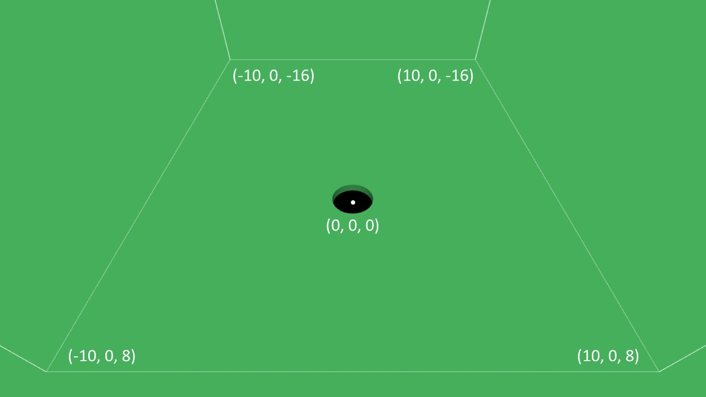
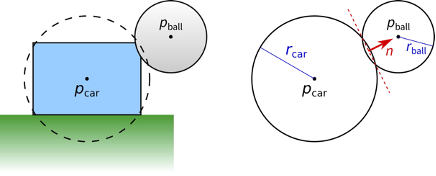
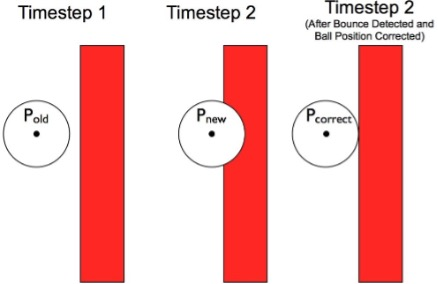
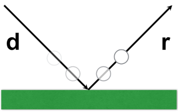
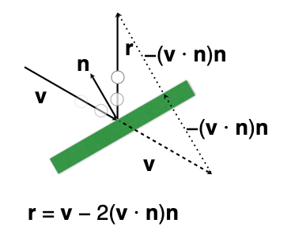

# Assignment 2: Trick Shot Simulator

**Due: Wednesday, October 21, 11:59pm CT**

The goal of this assignment is to create an interactive 3D trick shot game using a simplified physics simulation. You will implement the motion of billiard balls and handle their collisions with each other and the boundaries of the play area. Then, you will design your own stage where the player launches a cue ball to knock the nine ball into a hole. The catch is that the cue ball cannot touch the nine ball directly, so the player will need to use the other balls to execute a successful trick shot.

This program covers a number of important computer graphics concepts.  Specifically, you will learn to:

- Use TypeScript and GopherGfx to build a 3D graphics program
- Draw simple 3D geometric objects
- Work effectively with 3D points, vectors, and geometric transformations
- Balance the tradeoffs between realism and effective gameplay by simulating physics in a plausible but not necessarily realistic way
- Successfully program your first interactive 3D graphics game!

You can try a [finished version of the game](https://csci-4611-fall-2026.github.io/Assignments/Assignment-2/dist) on the course GitHub Pages.

## Repository Setup

We are using GitHub for submission of programming assignments.

**Step 1:** Create your private repository using the following link: https://classroom50.org/CSCI-4611-Fall-2026/csci-4611/assignments/assignment-2/accept

**Step 2:**  The system will then create a new private repository with starter code that is only accessible by you, the instructor, and the TAs. You can then use `git` to check out the code to your local machine. If you prefer a GUI application instead of the command line, then I recommend using [GitHub Desktop](https://github.com/apps/desktop) or Visual Studio Code's integrated source control.

## Prerequisites

To work with this code, you will first need to install [Node.js 24.21.0 LTS](https://nodejs.org/en/download) (or newer) and [Visual Studio Code](https://code.visualstudio.com/). 

## Getting Started

The starter code implements the general structure that we reviewed in lecture.  After cloning your repository, you will need to set up the initial project by pulling the dependencies from the node package manager with:

```
npm install
```

This will create a `node_modules` folder in your directory and download all the dependencies needed to run the project.  Note that this folder is listed in the `.gitignore` file, so it will not be committed to your repository.

You can compile and run a server with:

```
npm run start
```

Your program should open in a web browser automatically.  If not, you can run it by pointing your browser at `http://localhost:5173`.

## Assignment Overview

The following diagram shows the coordinate system used in the game. Note that we are using the standard OpenGL **right-handed coordinate system** where +X is to the right, +Y is up, and -Z is forward.



#### Simulating Physics

Most video games are designed to balance the tradeoff between physical realism and gameplay. A completely realistic simulation of all the physical interactions between moving objects can be very mathematically complex and potentially make the game difficult to play on a 2D screen, especially with the limited amount of control possible using a keyboard/mouse or controller input. Although we generally want objects to interact in a "physically plausible" way, using physics models that approximate or even change the laws of physics (e.g., gravity) can often result in gameplay that is more fun and engaging.

The "hole in the ground" was inspired by the delightfully clever 2018 game [Donut County](http://www.donutcounty.com/), which was created by indie developer [Ben Esposito](https://www.torahhorse.com/) based on a concept that originated during a game jam. In this game, the player controls a hole in the ground that increases in size each time an object falls inside it, eventually becoming large enough to swallow entire buildings. Donut County is a great example of a game that makes effective use of "magical" physics.  As Ben Esposito discovered, making a hole in computer graphics is actually much trickier than it sounds, and this [Rock Paper Shotgun article](https://www.rockpapershotgun.com/how-donut-countys-hole-works) has a very interesting discussion of the physical approximations and fakery that he used when developing the game.

For the purposes of this programming assignment, we simplify the simulation by assuming all moving objects are spheres. This avoids the mathematical complexity of more complex 3D shapes, so we don't need to write an entire physics engine to handle collisions between multiple object types.

#### Rigid Body Dynamics

The movement and interaction of solid, inflexible objects is known as rigid body dynamics, which is the most commonly used type of physical simulation in computer graphics and video games. This [introduction to video game physics](https://www.toptal.com/game/video-game-physics-part-i-an-introduction-to-rigid-body-dynamics) provides a nice supplemental reading if you are interested in learning more about the concepts and math involved in simulating rigid body dynamics.

To make this assignment practical to implement, we will make a few simplifying assumptions about the physics. Specifically, you should follow these guidelines in your code.

**Motion:** When implementing rigid body physics, first update the object's velocity *v* using its acceleration *a*: *v'* = *v* + *a* * *dt*. Then, compute the new position *p* using this updated velocity: *p'* = *p* + *v'* * *dt*. This occurs each frame in the `update()` method of the `RigidBody` class, where *dt* is the elapsed time in seconds.

**Friction:** To approximate friction and energy loss, you can simply reduce the velocity of the rigid body when it bounces off something. The starter code already includes the `frictionSlowDown` parameter used in the instructor's example, which is 0.95. Multiplying the entire velocity vector by this value after a bounce reduces the speed by 5%. This is a simplified approximation applied per impact, rather than a continuous friction force.

**Gravity:** The rigid body should accelerate downward due to gravity. Use an acceleration vector with zero X and Z components and a Y component equal to `RigidBody.gravity`. The starter code already sets this constant to -9.81, so gravity changes the vertical velocity each frame.

**Rotation:** The provided code also makes the balls appear to roll by setting their angular velocity from their motion along the ground. While airborne, they continue spinning with their existing angular velocity. This is a visual approximation; we do not simulate torque or the transfer of spin during collisions. You do not need to modify the rotation code.

#### Detecting Collisions

One of the main challenges in this assignment is handling collisions between two rigid bodies. For collision purposes, we will assume all objects are approximated using spheres, so we only need to detect whether these two spheres are intersecting. This simplifies collision tests and it is not as unusual of a simplification as you might think. In games, it is typical to test for collisions using a "proxy geometry" that is much simpler than the 3D model that is actually drawn on the screen. With this approach, you can calculate fast, approximate physics while also having good looking graphics. For example, the diagram below illustrates a collision between a ball and a car, both of which are approximated using spheres. Of course, this may result in detecting collisions when the car's rendered geometry does not actually hit the ball, or vice versa, but as long as the size of the proxy sphere and the car model are not too different, it shouldn't matter too much to the gameplay.



In any collision handling routine, there are two main steps: first, detecting whether a collision has occurred, and second, resolving the collision by updating the positions and velocities of the colliding objects. With spheres, collision detection is easy: two spheres have collided if the distance between their centers is less than the sum of their radii.  You can perform this calculation manually, or you can call a node's `intersects()` method using `gfx.IntersectionMode3.BOUNDING_SPHERE` as the intersection mode parameter.

#### Correcting Position After a Collision

Notice that the figure illustrates the case where the two spheres overlap each other. In other words, one has passed inside the other. In real life, if you have two solid spheres, this case would never occur. The spheres would bounce off each other before penetrating each other. However, this happens quite regularly in computer graphics simulation. If you update your simulation once each frame, the elapsed time (i.e., `deltaTime` or *dt*) between consecutive frames might be around 1/30–1/60 second. That is fast, but still not fast enough to capture the *exact* moment when the two rigid bodies first make contact. This means that if you update the position of the rigid body, you may have a situation where *p'* ends up being inside the other object or inside the floor or wall of the play area. When you detect this has occurred, you should calculate a corrected position for the rigid body that places it just outside of the obstacle, as shown in the diagram below.



For a collision with a boundary, correct the sphere's position so that its center is one radius inside the play area. For example, a sphere intersecting the ground should have its Y position set to the ground height plus its radius.

For a collision between two spheres, we can separate them along the line connecting their centers. Compute this direction by taking the **difference between the two sphere positions and then normalizing it**. The overlap distance is the **sum of the sphere radii minus the distance between their centers**. Move each sphere by half of this distance in opposite directions, so that they end up touching exactly. This correction does not depend on the spheres' velocities, so it also works when one or both spheres are stationary.

In summary, the goal here is to make sure that the spheres are touching, but not overlapping. The instructor's example splits the correction equally between the two spheres. 

#### Updating Velocity After a Collision

When a rigid body bounces off another object, its velocity *v* changes, but how? It depends on the normal of the surface it contacts. The following illustration shows a sphere bouncing off the ground plane. In this case, reflecting the sphere's velocity is very straightforward; we simply negate *v.y*, leaving *v.x* and *v.z* unchanged before applying the friction slow down factor. For the other boundaries, negate the velocity component perpendicular to the boundary instead. The instructor's example also treats very small ground bounces as resting contact by setting *v.y* to zero when its magnitude is less than 0.01, without applying the bounce slow down factor in that case.



However, if the sphere bounces off an inclined plane, the math gets a bit more complicated, as shown in the diagram below.



The sphere approaches with a velocity vector *v*. When the sphere bounces, its velocity is reflected using the plane's unit normal *n*. The equation for its new, reflected velocity *r* is shown above. This is a general formula for reflecting a vector across a plane, and it gets used in computer graphics lighting equations as well. Note that it involves a dot product!  Conveniently, the `Vector3` class has a built-in function to compute this reflection, given *v* and *n* as input parameters. Make sure to normalize *n* before using it.

So, if this is how a sphere bounces off an inclined plane, what about colliding with another sphere? Actually, we can use the same reflection equation, but we first need to account for the motion of both spheres. We assume that all spheres have **equal mass**, even if their radii differ. The velocity of their center of mass is therefore the **average of their velocity vectors**: *vcenter* = (*vsphere1* + *vsphere2*) / 2. Subtract this average from each sphere's velocity to compute its velocity relative to the center of mass. For example, *vrel1* = *vsphere1* - *vcenter*, which is equivalent to (*vsphere1* - *vsphere2*) / 2. The division by two comes from the equal-mass assumption; it does not mean that the spheres must share kinetic energy equally.

Next, use the collision normal computed from the **difference between the two sphere centers, normalized to unit length**. Reflect each sphere's velocity relative to the center of mass using this normal (or its opposite for the other sphere). Then, **add the center-of-mass velocity back** to each reflected vector to obtain the new velocities in world space. This last step is important because the balls need to retain their shared motion through the scene. Finally, multiply each new velocity by `frictionSlowDown` to approximate friction and energy loss.

Note: the instructor's solution includes one additional safeguard after correcting the positions. With the collision normal pointing from sphere 2 toward sphere 1, it computes the dot product of (*vsphere1* - *vsphere2*) with the normal. If it is nonnegative, the spheres are already separating or have no relative motion along the normal, so the reflection and friction slow down steps are skipped. This avoids bouncing them again just because they still overlap. This safeguard improves robustness, but it is **not** an assignment requirement.

#### Summary

In summary, your code to handle the collisions between two rigid bodies should follow these steps, each of which involves the kind of 3D graphics math, working with points and vectors, that we have been learning about in class:

- Detect that the two spheres have collided (and probably penetrated each other).
- Compute a unit collision normal from the difference between the sphere centers, using a fixed unit direction if the centers coincide.
- Correct the overlap by moving each sphere half the overlap distance in opposite directions along the normal.
- Compute the center-of-mass velocity: *vcenter* = (*vsphere1* + *vsphere2*) / 2.
- Compute each sphere's velocity relative to the center of mass, for example: *vrel1* = *vsphere1* - *vcenter*.
- Reflect each relative velocity using the collision normal, then add *vcenter* back to obtain the new world-space velocity.
- Finally, multiply each sphere's velocity by `frictionSlowDown` to approximate friction and energy loss.

## Rubric

Functional requirements are graded out of 20 points. Additionally, your submission will be evaluated for code quality (2 points). After your program is submitted, you will also schedule an in-person meeting with a graduate TA for a code understanding check (4 points). The overall assignment grade is therefore worth a total of 26 points.

#### Part 1: Rigid Body Physics

In this part, you will need to complete the code in the `RigidBody` class to make the spheres move according to the physics model described above.  

- First, you should compute the downward acceleration due to gravity. (1)
- Next, compute the updated velocity of the rigid body. (1)
- Compute the updated position of the object. (1)

#### Part 2: Boundary Collisions

- Complete the code in the `handleBoundaryCollision()` method to detect contact between a rigid body and the ground, and then make it bounce in the correct direction. (2)
- After that is working, extend this method to also make the spheres bounce off the four walls. When these steps are working correctly, all the spheres in the test scene should bounce off the boundaries to remain in the play area unless they fall inside the hole. (2)
- Finally, to make the collisions more plausible, we should slow down the rigid body after the collision using the `frictionSlowDown` parameter. (2)

#### Part 3: Handling Rigid Body Collisions

- Complete the code in the `handleObjectCollision()` to detect contact between spheres.  (1)
- If the cue ball and nine ball collide, reset the stage by calling `startNextStage()` and return without resolving the collision. (1)
- If a collision is detected, correct the position of each sphere so they are no longer intersecting. (2)
- Compute the reflected velocity of each sphere using the physics equations described above. (2)

#### Part 4: Create Your Own Stage

For the last part of this assignment, you should add code in the `startNextStage()` method to create your own custom scene that will be loaded after the user completes the test scene. For this game, the objective is to hit the nine ball into the hole. However, the cue ball cannot touch the nine ball directly. The scene needs to be set up so that the user can launch the cue ball into other numbered balls that can potentially collide with the nine ball and knock it into the hole.

The cue ball and game win logic is already set up. You will need to add:

- The nine ball that wins the game when it falls into the hole. (1)
- Set up the hole in a different location than the center. You may optionally decide to adjust the size of the hole to make the shot easier or more difficult. (1) 
- At least three other numbered balls in a different spatial configuration than the instructor's example scene. (2)

#### Submission: Build and Deploy

- To submit the assignment for grading, you will need to update your `README.md` file and then deploy to GitHub Pages, as described below. (1)

## Wizard Bonus Challenge

All of the assignments in the course will include great opportunities for students to go beyond the requirements of the assignment and do cool extra work. On each assignment, you can earn **one bonus point** for implementing a meaningful new feature to your program. This should involve some original new programming, and should not just be something that can be quickly implemented by copying and slightly modifying existing code. 

For example, adding more stages that place balls in different positions but otherwise work exactly the same would not be sufficient. However, adding another stage (or augmenting the existing one) with different game logic, behaviors, or other computer graphics features would be considered bonus-worthy.

**Important:** Make sure to document your wizard functionality in your readme file, so that the TAs know what to look for when they grade your program.

The wizard bonus challenge also offers you a chance to show off your skills and creativity!  While grading the assignments the TAs will identify the best four or five examples of people doing cool stuff with computer graphics. We call these students our **wizards**, and after each assignment, the students selected as wizards will have their programs demonstrated to the class.

## Assignment Submission

When you have finished the assignment, you should complete the missing information in your `README.md` file. Then, you will need to run the following command:

```
npm run submit
```

This compiles your TypeScript program into a JavaScript bundle that will be placed in the `submission` folder. **To complete your submission, you should commit the contents of the `submission` folder and then push to GitHub.**

The push to GitHub will trigger a server-side workflow that will automatically deploy your build as a website on GitHub pages. Note that you may need to wait a couple minutes for the deployment to become active. Make sure to test everything by pointing your web browser at the GitHub pages URL for your repository:

```
https://csci-4611-fall-2026.github.io/your-repo-name-here
```

Note that the published JavaScript bundle code generated by the TypeScript compiler has been obfuscated so that it is not human-readable. So, you can feel free to send this link to other students, friends, and family to show off your work!

## Schedule a Code Understanding Check

After you submit your code, you can schedule a meeting with a graduate TA for the code understanding check. Instructions will be posted closer to the assignment submission deadline.

## Acknowledgments

This game uses royalty-free sound effects from [ZapSplat](https://www.zapsplat.com/). Some imagery and text in the assignment description was adapted from previous assignments by Rahul Narin and Daniel Keefe.

## License

Public distribution of assignment source code outside the class is **prohibited**. If you want to showcase your work to potential employers, then you may distribute the link to the compiled build on GitHub Pages or share the source code with them **privately**.
